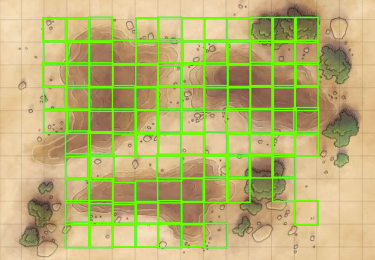

# Fantasy Maps

Virtual tabletop gaming continues to grow in popularity. Often times, a core requirement for
virtual tabletop gaming apps (VTTs) is to provide a map (an image) and some metadata that 
describes the valid game moves (as a grid) on that map.

With this explosion in popularity of VTTs, many folks in the gaming community publish their
own maps for others to use. However, the maps don't always include the metadata needed for
a VTT app.

That's where the Fantasy Maps project comes in.

This project uses
[Vertex AI](https://cloud.google.com/vertex-ai),
AutoML object detection models to train a model capable of identifying gridlines on a map
like the example below:

## Products demonstrated

This project demonstrates how to combine multiple Google Cloud products together
to build this ML model. Specifically, the project demonstrates:

+ How to use [Firestore](https://cloud.google.com/firestore/docs) to store Vertex AI
  training metadata for unstructured data (e.g. images)
+ How to use [Secret Manager](https://cloud.google.com/secret-manager/docs) to keep
  API keys hidden until they're needed
+ How to store data in [Cloud Storage](https://cloud.google.com/storage/docs)
+ How to build a
  [Vertex AI Pipeline](https://cloud.google.com/vertex-ai/docs/pipelines/introduction?hl=en)
  to train, deploy, and retrain a Vertex AI model
+ How to use Vertex AI to to train, deploy, and get inferences from an image object
  detection model

## Tutorial version

The project consists of five notebooks, where each notebook builds upon the lessons
of the previous notebook. The notebooks are as follows:

1. [Storing training data in Firestore](1_firestore.ipynb)
2. Creating a Vertex AI Pipeline to store training data in Firestore
3. 